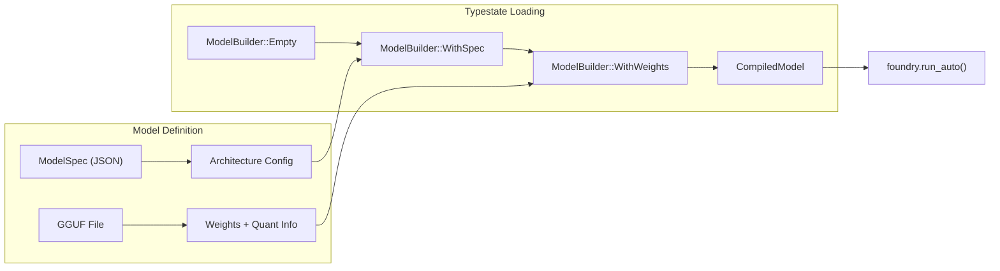

# Foundry Autoregressive Generation System

Declarative execution plans + typestate model loading for Foundry.

## User Review Required

> [!IMPORTANT]
> This design separates **architecture definition** (JSON DSL) from **weight loading** (GGUF/other). A `ModelBuilder` with typestate ensures the loading sequence is correct at compile time.

---

## Architecture Overview



---

## Proposed Changes

### Execution Plan DSL (Auto-Generated Steps)

Instead of a manual `Step` enum, we use `typetag` for trait-object serialization. Each `#[derive(Kernel)]` auto-generates a `Step` impl—**no manual updates when adding kernels**.

#### [NEW] [foundry/spec/step.rs](file:///Volumes/2TB/test-burn/crates/metallic/src/foundry/spec/step.rs)

```rust
/// Trait for steps in a model execution plan.
/// Auto-implemented by #[derive(Kernel)] when `step = true`.
#[typetag::serde(tag = "op")]
pub trait Step: Send + Sync {
    fn execute(&self, f: &mut Foundry, bindings: &TensorBindings) -> Result<(), MetalError>;
}
```

#### [MODIFY] [metallic-macros/src/kernel.rs](file:///Volumes/2TB/test-burn/crates/metallic-macros/src/kernel.rs)

The `#[derive(Kernel)]` macro emits:
```rust
#[typetag::serde(name = "RmsNorm")]  // auto-generated from struct name
impl Step for RmsNorm {
    fn execute(&self, f: &mut Foundry, _: &TensorBindings) -> Result<(), MetalError> {
        f.run_auto(self)
    }
}
```

#### [NEW] [foundry/spec/mod.rs](file:///Volumes/2TB/test-burn/crates/metallic/src/foundry/spec/mod.rs)

```rust
#[derive(Debug, Clone, Deserialize)]
pub struct ModelSpec {
    pub name: String,
    pub architecture: Architecture,
}

#[derive(Deserialize)]
pub struct Architecture {
    pub d_model: usize,
    pub n_layers: usize,
    // ...
    pub forward: Vec<Box<dyn Step>>,  // trait objects!
}
```

#### JSON Example (extensible without code changes)

```json
{
  "forward": [
    {"op": "RmsNorm", "input": "x", "gamma": "attn_norm", "output": "y"},
    {"op": "Gemv", "input": "y", "weight": "w_q", "output": "q"},
    {"op": "MyNewFusedKernel", ...}  
  ]
}
```

#### How It Works

1. **Add kernel**: `#[derive(Kernel)] struct MyOp { ... }`
2. **Macro emits**: `#[typetag::serde(name = "MyOp")] impl Step for MyOp`
3. **JSON works**: `{"op": "MyOp", ...}` deserializes automatically
4. **No Step enum to maintain**

---

### Typestate Model Builder

#### [NEW] [foundry/model/builder.rs](file:///Volumes/2TB/test-burn/crates/metallic/src/foundry/model/builder.rs)

```rust
/// Typestate markers
pub struct Empty;
pub struct WithSpec;
pub struct WithWeights;

/// Builder that enforces loading order at compile time.
pub struct ModelBuilder<State> {
    spec: Option<ModelSpec>,
    weights: Option<WeightBundle>,
    policy: Option<PolicyKind>,
    _state: PhantomData<State>,
}

impl ModelBuilder<Empty> {
    pub fn new() -> Self { ... }
    
    /// Load execution plan from JSON
    pub fn with_spec(self, spec: ModelSpec) -> ModelBuilder<WithSpec> { ... }
}

impl ModelBuilder<WithSpec> {
    /// Load weights from GGUF (auto-detects quantization)
    pub fn with_gguf(self, path: &Path) -> Result<ModelBuilder<WithWeights>, Error> {
        let (weights, quant) = gguf::load(path)?;
        Ok(ModelBuilder {
            spec: self.spec,
            weights: Some(weights),
            policy: Some(quant.into()),  // Q8 or F16 from GGUF metadata
            _state: PhantomData,
        })
    }
}

impl ModelBuilder<WithWeights> {
    /// Compile into a runnable model
    pub fn build(self, foundry: &mut Foundry) -> Result<CompiledModel, Error> {
        // Register policy from GGUF quant type
        match self.policy {
            Some(PolicyKind::Q8) => foundry.set_policy::<Q8Model>(),
            _ => foundry.set_policy::<F16Model>(),
        }
        
        // Compile execution plan
        let executor = Executor::compile(&self.spec.unwrap(), &self.weights.unwrap())?;
        Ok(CompiledModel { executor })
    }
}
```

---

### Compiled Model Executor

#### [NEW] [foundry/model/executor.rs](file:///Volumes/2TB/test-burn/crates/metallic/src/foundry/model/executor.rs)

```rust
/// A compiled, ready-to-run model
pub struct CompiledModel {
    executor: Executor,
}

impl CompiledModel {
    pub fn forward(&self, f: &mut Foundry, token_id: u32, pos: usize) -> Result<TensorArg, MetalError> {
        self.executor.run_step(f, token_id, pos)
    }
    
    pub fn sample(&self, f: &mut Foundry, logits: &TensorArg) -> Result<u32, MetalError> {
        self.executor.run_sample(f, logits)
    }
}

/// Interprets the ModelSpec execution plan
struct Executor {
    steps: Vec<CompiledStep>,
    tensors: HashMap<String, TensorArg>,
}

impl Executor {
    fn run_step(&self, f: &mut Foundry, token_id: u32, pos: usize) -> Result<TensorArg, MetalError> {
        for step in &self.steps {
            match step {
                CompiledStep::RmsNorm { input, gamma, output } => {
                    f.run_auto(&RmsNorm::new(input, gamma, output))?;
                }
                CompiledStep::Gemv { input, weight, output, .. } => {
                    f.run_auto(&Gemv::new(input, weight, output))?;
                }
                // ... other ops
            }
        }
        Ok(self.tensors.get("output").unwrap().clone())
    }
}
```

---

### Policy Auto-Detection

#### [MODIFY] [foundry/mod.rs](file:///Volumes/2TB/test-burn/crates/metallic/src/foundry/mod.rs)

```rust
impl Foundry {
    /// Run kernel with auto-detected policy from registered model.
    pub fn run_auto<K: Kernel>(&mut self, kernel: &K) -> Result<(), MetalError> {
        if self.get_resource::<PolicyQ8>().is_some() {
            self.run_with_policy::<PolicyQ8, K>(kernel)
        } else {
            self.run(kernel)  // Default F16
        }
    }
}
```

---

### Usage Example

```rust
let model = ModelBuilder::new()
    .with_spec_file("models/qwen25.json")?   // Load architecture DSL
    .with_gguf("models/qwen25-q8.gguf")?     // Load weights (auto-detects Q8)
    .build(&mut foundry)?;                    // Compile + register policy

for _ in 0..max_tokens {
    let hidden = model.forward(&mut foundry, token_id, pos)?;
    token_id = model.sample(&mut foundry, &hidden)?;
    pos += 1;
}
```

---

## DX Summary

| Aspect | Before | After |
|--------|--------|-------|
| **Model definition** | Hardcoded Rust structs | JSON DSL |
| **Loading order** | Runtime checks | Typestate compile-time |
| **Multi-architecture** | Separate impl per model | Same executor, different specs |
| **Policy selection** | Manual per-kernel | Auto from GGUF metadata |
| **Weight formats** | GGUF only | Extensible (safetensors, etc.) |

---

## File Summary

| Action | File | Purpose |
|--------|------|---------|
| NEW | `foundry/spec/mod.rs` | ModelSpec, Architecture, Step DSL |
| NEW | `foundry/model/builder.rs` | Typestate ModelBuilder |
| NEW | `foundry/model/executor.rs` | CompiledModel, Executor |
| NEW | `foundry/models/qwen25/spec.json` | Qwen2.5 execution plan |
| MODIFY | [foundry/mod.rs](file:///Volumes/2TB/test-burn/crates/metallic/src/foundry/mod.rs) | Add `run_auto()`, policy resource |

---

## Verification Plan

1. **Parse test**: Load qwen25.json spec, verify Step parsing
2. **Typestate test**: Confirm compile error if `.with_gguf()` called before `.with_spec()`
3. **Policy auto-detect**: Load Q8 GGUF, verify `run_auto` uses PolicyQ8
4. **Parity test**: Compare Foundry CompiledModel output vs legacy
5. **Throughput**: Match or exceed 63 tok/s baseline
